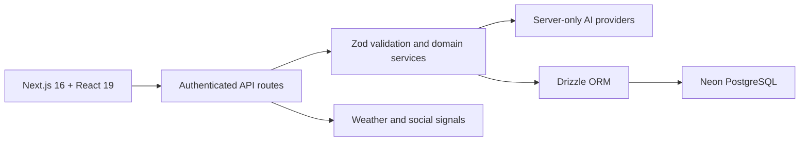

<div align="center">

# Travello — Green & Inclusive Travel

### Smart, sustainable, and accessible journey planning

[](https://asdtyuikl.vercel.app/)
[](#-hackathon-achievement)
[](https://nextjs.org/)
[](https://www.typescriptlang.org/)
[](https://neon.tech/)

**A full-stack travel platform that helps people choose lower-impact journeys without compromising accessibility, comfort, or practicality.**

[Live demo](https://asdtyuikl.vercel.app/) · [Features](#-product-features) · [Architecture](#-architecture) · [Setup](#-local-setup) · [Team](#-team-bluevector)

</div>

---

## 🏆 Hackathon achievement

Built by **Team BlueVector** for **Pillai Tech Alegria presents HackCelestial 3.0**.

The project was selected among the **Top 50 teams**, recognising its combination of sustainable travel recommendations, structured accessibility support, hospitality assessment, community participation, and an AI-assisted planning workflow.

### PS ID 5 — Green & Inclusive Travel

The challenge asked teams to make travel and hospitality more environmentally responsible, accessible, and inclusive while balancing cost, time, comfort, and convenience.

Travello responds with a unified platform for:

- lower-impact transport and itinerary recommendations;
- carbon and sustainability comparisons;
- mobility and accessibility-aware planning;
- inclusive destination and activity discovery;
- sustainable hospitality assessment;
- eco-challenges, rewards, community reporting, and impact tracking;
- weather-informed destination simulation and advice.

## 👥 Team BlueVector

| Member | Role |
| --- | --- |
| **Asaad Siddiqui** | Full-stack engineering, AI integration, architecture |
| **Abbas Sayyed** | Team contributor |
| **Sayyed Alafiya** | Team contributor |
| **Patel Taiba** | Team contributor |
| **Shaikh Ayra** | Team contributor |

## 🌐 Live demo

**https://asdtyuikl.vercel.app/**


The screenshot above was captured from the deployed Vercel application and verified before inclusion.

## The problem

Travelers often compare price, time, and convenience without reliable information about environmental impact or whether transport, accommodation, and experiences meet mobility, visual, hearing, dietary, or other accessibility requirements.

Hospitality businesses also need practical ways to assess energy, water, waste, mobility, and resource-efficiency opportunities.

Travello combines those needs in one product: **plan inclusive trips, compare lower-impact options, discover suitable experiences, track positive actions, and surface sustainability opportunities.**

## ✨ Product features

### Accessibility-first profile

- Conversational profile setup
- Structured mobility, visual, hearing, dietary, and personal requirements
- Saved preferences reused during trip planning
- Relational persistence rather than an opaque chat transcript

### AI-assisted trip planner

- One-question-at-a-time trip intake
- Four normalised itinerary options
- Accessibility and sustainability trade-off comparison
- Modify-before-confirm workflow
- Strict server validation before persistence
- Downloadable PDF itinerary

### Sustainable discovery and mobility

- Eco-score and crowd-pressure signals
- Lower-impact transport comparison
- Accessible trail and destination information
- Walking, cycling, public/shared mobility, and practical alternatives

### Hospitality intelligence

- Weighted sustainability checklist
- Separate traveller feedback and business assessments
- Derived environmental-performance score
- Areas for energy, water, food, transport, and waste improvement

### Community and impact

- Eco-challenges and evidence submissions
- Reward and points history
- Community posts, likes, and comments
- Incident reporting and saved destinations
- Personal impact dashboard

### Weather-driven digital twin

- Destination simulation under changing weather scenarios
- Open-Meteo integration with labelled fallback data
- Public social-signal input with sample fallback
- AI advisor output with deterministic fallback

## 🧭 Trust and safety principle

> **AI can suggest, but the application owns structure, validation, security, and persisted truth.**

This principle appears throughout the platform:

- AI keys remain in server-only modules.
- Zod schemas validate and repair generated plans.
- Sensitive queries are scoped to the authenticated user.
- Prototype or estimated values are labelled clearly.
- External AI, weather, and social-source failures fall back gracefully.
- Confirmed trips are revalidated before database writes.

## 🏗 Architecture



### Technology stack

| Layer | Technology |
| --- | --- |
| Framework | Next.js 16 App Router |
| UI | React 19, Tailwind CSS 4 |
| Language | TypeScript, strict mode |
| Database | Neon PostgreSQL |
| ORM | Drizzle ORM and Drizzle Kit |
| Authentication | bcrypt + signed JWT cookie |
| Validation | Zod |
| AI planning | OpenRouter, server-only |
| AI digital-twin advisor | Nugen, server-only |
| Mapping and charts | Leaflet and Recharts |
| Documents | pdf-lib |
| Testing | Playwright E2E and API scripts |
| Deployment | Vercel |

## 🗂 Repository structure

```text
.
├── src/
│   ├── app/                    # Public, authenticated, and API routes
│   ├── components/             # Planner, profile, dashboard, and twin UI
│   ├── db/                     # Drizzle schema
│   ├── lib/                    # Auth, planning, hospitality, impact, AI services
│   ├── types/                  # Shared TypeScript contracts
│   └── proxy.ts                # Central route protection
├── drizzle/                    # SQL migrations and metadata
├── public/                     # Product assets
├── scripts/                    # Seed and E2E flows
├── docs/images/                # Verified showcase screenshots
└── .env.example                # Environment template
```

## 🚀 Local setup

### Requirements

- Node.js 20 or newer
- npm
- Neon PostgreSQL database

```bash
git clone https://github.com/Asaad-Siddiqui/Travello-Green-Inclusive-Travel.git
cd Travello-Green-Inclusive-Travel
npm install
cp .env.example .env.local
npm run db:migrate
npm run dev
```

Open http://localhost:3000.

### Required environment variables

```text
DATABASE_URL=
AUTH_SECRET=
OPENROUTER_API_KEY=
NUGEN_API_KEY=
```

Never expose provider keys as `NEXT_PUBLIC_*` values.

## ✅ Validation commands

```bash
npm run lint
npm run typecheck
npm run build
npm run test:e2e
npm run test:e2e:trip
npm run test:trip:api
```

The project includes coverage for authentication, accessibility-profile completion, responsive layout, trip planning, plan modification, confirmation, PDF output, API guards, owner-only access, and validation failures.

## 🔐 Security highlights

- Signed session cookie and central protected-route handling
- Server-only provider credentials
- Authenticated, user-scoped data access
- Revalidation before trip persistence
- Owner-only PDF and trip access
- Explicit fallbacks instead of silent fabricated live data

## ⚠ Prototype boundaries

- Sustainability and carbon figures are estimates, not certified measurements.
- The catalogue and some external-source fallbacks use seeded demonstration data.
- There are no live booking or payment integrations.
- A complete account recovery and production operations pipeline remains future work.

## 💼 Resume-ready summary

> Built a Top-50 HackCelestial 3.0 full-stack sustainable and accessible travel platform using Next.js 16, React 19, TypeScript, Neon PostgreSQL, Drizzle ORM, Zod, and server-side AI integrations. Implemented accessibility profiles, multi-option itinerary planning, sustainability scoring, community challenges, hospitality assessment, impact tracking, weather simulation, PDF generation, authenticated APIs, and Playwright validation.

## 🔭 Future improvements

- Certified carbon-data and accessibility providers
- Live booking and multimodal routing integrations
- Native notifications and disruption monitoring
- Business sustainability recommendations with longitudinal tracking
- More languages, currencies, and regional accessibility standards
- Expanded automated accessibility and visual regression testing

---

<div align="center">

**Team BlueVector · Top 50 · HackCelestial 3.0**

</div>
